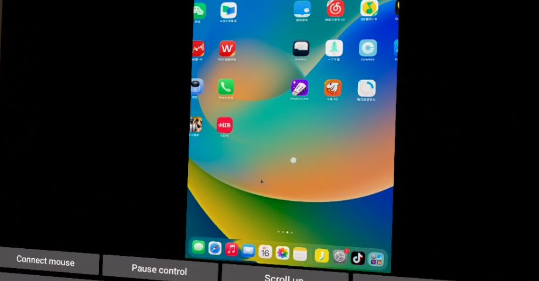

# Real device showcase

## Selected image

- Source: live Meta Casting view from the user's Quest 3, 2026-09-16.
- Application: 0.2.29-openssl3-preview.
- Purpose: demonstrate a mirrored home screen, on-screen pointer and visible Connect mouse/Pause control buttons.
- Processing: browser screenshot of a rectangular region only; no generated or reconstructed interface, recoloring or retouching.
- Framing: a partial, angled detail. The full window and complete toolbar are not shown. It is not presented as a store-ready hero image.
- Excluded from the selected region: browser account/header, passthrough surroundings and the physical computer display.
- Sender application icons belong to their respective owners; their appearance does not imply endorsement.

## Selection record

Other candidate captures remain outside the Git repository. Frames showing the
room, physical computer display, social profiles or third-party video content
were not selected for the project showcase. No continuous video recording was made.

Still needed: a centered complete app window, Settings and beginner-guide pages.
These have not yet been captured in a suitable composition. Prefer a neutral
sender home screen or a purpose-made sample document for future captures.
