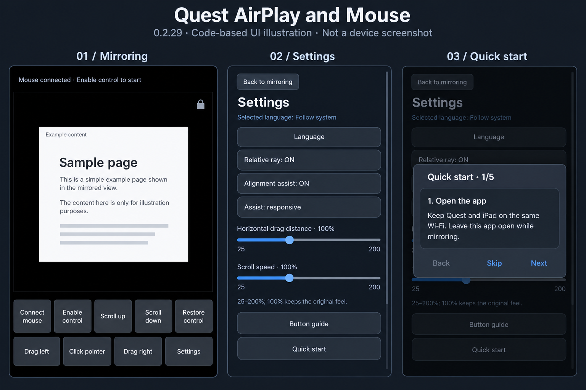

# Code-based UI illustrations

Generated illustration based on MainActivity.kt and English string resources of
0.2.29. Panels show mirroring, Settings and the first Quick start dialog. This is
not a device screenshot or a pixel-exact rendering. Typography, proportions,
Android widget styling and condensed helper text are illustrative. The mirrored
sample document is example content, not an application feature.

The main page preserves the five-plus-four button order. Settings preserves
language, ray, alignment, assist speed, two gesture sliders and guide entries.
The guide shows one card at a time. The image does not replace the separately
recorded actual Casting screenshot.
